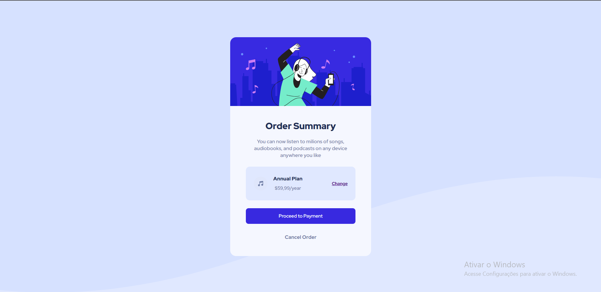
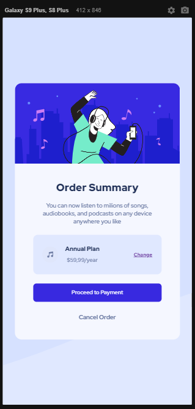

# Order Sumary

Este é um projeto desenvolvido apartir do desafio do site FrontEnd Mentor com o meso nome:

https://www.frontendmentor.io/challenges/order-summary-component-QlPmajDUj

Este projeto foi feito para estudo próprio, com aprendizagem da propriedade em CSS: FLEXBOX

## Imagens do projeto:
Desktop:

Mobile: 

## Tecnologias usadas:
- Html
- CSS